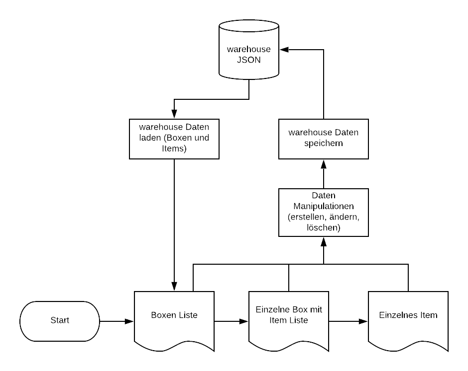

# PROJEKT chaosbox
## Abstract
Wenn man einen Abstellraum hat, kommt man früher oder später an einen Punkt, an dem man nicht mehr weiss, was da alles wo verstaut ist. Hat man nun einen Stauraum zusammen mit mehreren Personen ist es noch schlimmer, da man nicht alles selbst eingelagert hat. Und richtig mühsam wird es, wenn man beispielsweise als Verein ein Lagerraum hat, in welchem man verschiedenste Sachen aufbewahrt, die auch immer wieder verwendet werden oder verwendet werden könnten, wenn man denn wüsste was alles in den jeweiligen Kisten ist. Dies ist zugleich der Anwendungsfall welcher zur Umsetzung von chaosbox motivert hat.

## chaosbox
chaosbox ist eine warehouse management Lösung in Form einer WebApp welche auf auf Python und Flask basiert.
Das Ziel ist, dass damit ein kleines Lager, dies kann Privat oder auch von einem kleineren Unternehmen oder einem Verein o.Ä. mit einem geringen Aufwand gemanaged werden kann. Es wird gewisse Abstriche geben im Vergleich zu grösseren warehouse management Lösungen, da es um die Einfachheit geht und easy to use sein sollte. Es soll aber möglich sein, den Inhalt von mehreren Kisten einzulagern im System und auch wieder anuzuzeigen, bzw. abzuändern (falls sich z.B. bei Gebrauchsgegenständen die Menge ändert oder ein Fehler eingetippt wurde). Ausserdem liefert die chaosbox einige Statistische Fakten über Anzahl Boxen und Items und so weiter auf der Startseite.

## Anforderungen
* Lagerboxen hinzufügen, anzeigen, ändern, löschen
* Items in einer Box erstellen, ändern, löschen
* Alle Boxen anzeigen
* Alle Items einer Box anzeigen
* Speicherung der Daten in einer JSON-Datei

## Flussdiagramm

## Next steps / Erweiterungen
In nächsten Schritten könnte die chaosbox um folgende Features erweitert werden:
* Möglichkeit zum ausleihen von Items/Boxen
* Ausleih-History von Boxen/Items
* Suchfunktion für Boxen und Items (Datenstruktur müsste evtl. umgestellt werden, nicht mehr verschachtelt sondern mit Referenzen zwischen Boxen und Items)
* Backup- und Restore-Funktion
* Generierung von QR-Codes auf der Boxen-Seite (mit Link zur Box) welche gedruckt und auf die Box geklebt werden können, so kann man die Box abscannen und man hat gleich die Übersicht was alles drin ist
* Ausdruck von Boxen-Übersicht mit allen Items